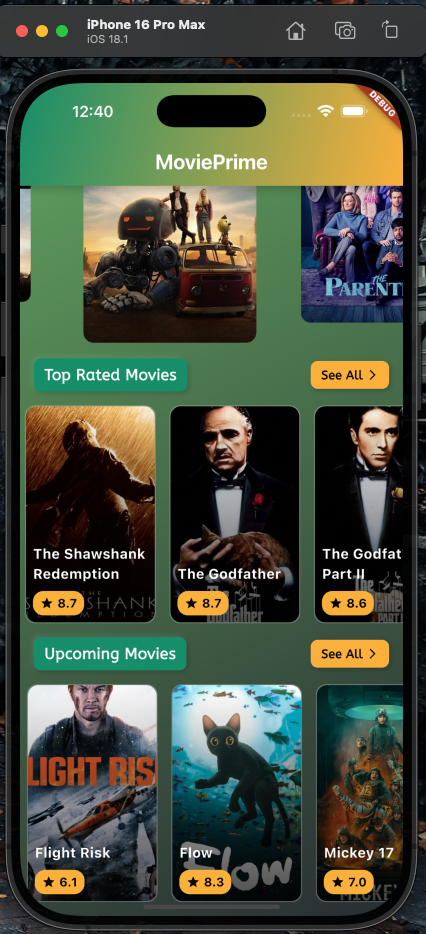
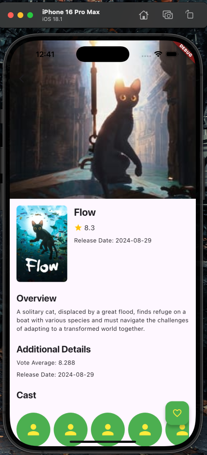
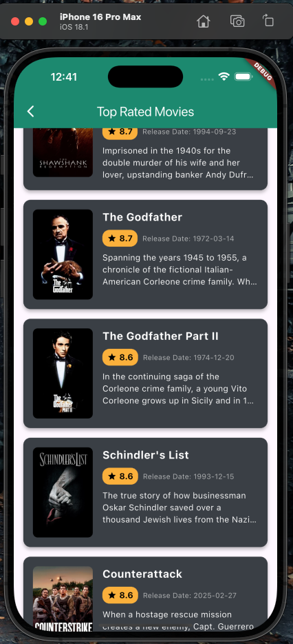
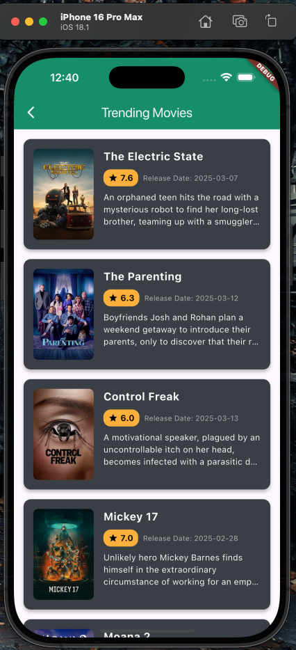

#MOVIE_PRIME

🎬 MoviePrime is a feature-rich Flutter app designed for movie enthusiasts.
It provides detailed information about movies, including posters, ratings, release dates, and more.
With a modern and intuitive user interface,
MoviePrime offers a seamless experience for browsing and discovering movies.

Features

✨ Key Features:

Home Screen: Displays trending movies, popular movies, and categories.

Movie Details Screen: View detailed information about a movie, including title, poster, rating, release date, and overview.

Splash Screen: A visually appealing splash screen with a gradient background and smooth animations.

Dynamic Backgrounds: Custom background widgets for a modern and immersive experience.

Movie Lists: Browse movies by category (e.g., trending, popular, upcoming).

Responsive Design: The app is designed to work seamlessly on both mobile and tablet devices.

Techy UI: A modern and tech-inspired user interface with clean layouts and animations.

Screenshots

Splash Screen	Home Screen	Movie Details Screen

Getting Started

Prerequisites

Before running the app, ensure you have the following installed:

Flutter SDK: Install Flutter
Android Studio or VS Code: For development and debugging.
Git: For version control.
Installation

Clone the Repository:
bash
Copy
git clone https://github.com/your-username/MoviePrime.git
cd MoviePrime
Install Dependencies:
bash
Copy
flutter pub get
Run the App:
bash
Copy
flutter run
Folder Structure

Here’s an overview of the project structure:

Copy
MoviePrime/
├── lib/
│   ├── api/                  # API service for fetching movie data
│   ├── constants/            # App constants (e.g., colors, strings, API keys)
│   ├── models/               # Data models (e.g., Movie model)
│   ├── screens/              # App screens (e.g., SplashScreen, HomeScreen, MovieDetailScreen)
│   ├── widgets/              # Custom widgets (e.g., AppBarWidget, MovieCard, MovieSlider)
│   ├── main.dart             # Entry point of the app
├── assets/                   # Static assets (e.g., images, fonts)
├── pubspec.yaml              # Flutter dependencies and assets configuration
├── README.md                 # Project documentation
Dependencies

The app uses the following Flutter packages:

flutter/material.dart: For building the UI.
http: For making API calls to fetch movie data.
provider: For state management.
cached_network_image: For caching and displaying network images efficiently.
To install the dependencies, run:

bash
Copy
flutter pub get
Code Overview

Key Components

API Service:
Located in lib/api/.
Handles API calls to fetch movie data (e.g., trending movies, popular movies).
Constants:
Located in lib/constants/.
Stores app-wide constants such as colors, strings, and API keys.
Models:
Located in lib/models/.
Defines data models (e.g., Movie).
Screens:
Located in lib/screens/.
Includes:
SplashScreen: The initial screen with animations.
HomeScreen: Displays trending movies, popular movies, and categories.
MovieDetailScreen: Shows detailed information about a selected movie.
MovieListScreen: Displays a list of movies based on category.
Widgets:
Located in lib/widgets/.
Includes reusable components such as:
AppBarWidget: Custom app bar.
MovieCard: Displays a movie poster and title.
MovieSlider: A horizontal slider for displaying movies.
CategoryTile: Displays movie categories.
DynamicBackgroundWidget: A custom background widget for immersive UI.
SeeAllButton: A button to navigate to the full list of movies.
Contributing

Contributions are welcome! If you'd like to contribute to MoviePrime, follow these steps:

Fork the repository.
Create a new branch (git checkout -b feature/YourFeatureName).
Commit your changes (git commit -m 'Add some feature').
Push to the branch (git push origin feature/YourFeatureName).
Open a pull request.
License

This project is licensed under the MIT License. See the LICENSE file for details.

Acknowledgments

Flutter: For providing an amazing framework to build beautiful apps.
TMDB API: For providing movie data.
Contact

If you have any questions or feedback, feel free to reach out:

Email: ahsan.dox@gmail.com
GitHub: Ahsan668
Enjoy exploring MoviePrime! 🎥🍿
# MoviePrime
